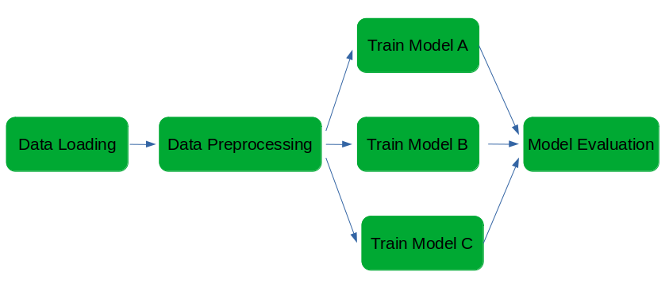
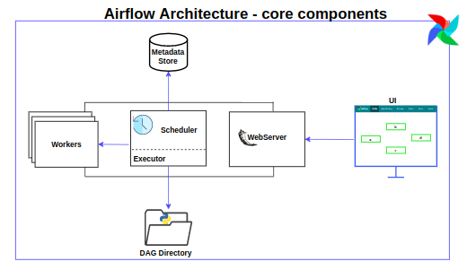

# Machine Learning With Airflow - Study Notes

  

Hi!! :raising_hand_man:

This repository contains my personal study notes both on **Airflow** concepts and practices and its aplications for **Machine Learning workflows**.

Please, check the contents bellow for more.

---
## Contents 

- <a href="#core_concepts">Airflow: walking through some core concepts</a>
    - <a href="#a1">What Airflow is?</a>
    - <a href="#a2">What is a DAG?</a>
    - <a href="#a3">Underlying Components</a>

- <a href="#ml_workflow">Machine Learning Workflows: an overview</a> (TODO)

- <a href="#airflow_ml">The Role of Airflow in ML Workflows</a> (TODO)

- More Topics in the Future.. (TODO)

- <a href="#resources">Resources</a> (TODO)

--- 
## Airflow: walking through some core concepts

<a href="#contents">Back to Contents</a>

### What Airflow is?

&ensp;&ensp;&ensp;&ensp;In simply put, Airflow is a job scheduler with some extra powers. That 'job' can be anything, not only data related jobs.

&ensp;&ensp;&ensp;&ensp;But let's see a more formal definition. According to <a href="https://airflow.apache.org/docs/apache-airflow/stable/index.html">the documentation</a>, it is a platform (and open-source) used for workflow's development, scheduling, and monitoring. In addition, it allows us to build workflows connected with many other technologies, such as container's orchestrators and cloud services.

&ensp;&ensp;&ensp;&ensp;Since Airflow is developed in Python (and the workflow we build with it too), it is chosen by many professionals since Python brings a lot of extensibility and scalability to our application. Although that python-based characteristic is usually taken as an advantage, it can also be a disadvantage: it requires the developer to know Python Programming.

&ensp;&ensp;&ensp;&ensp;Besides that, Airflow brings, among many others, a lot more facilities:

- A friendly UI for monitoring all scheduled/executed/running tasks;

- Integration with a lot of other tools;

- Backfilling for processing, for running dags for a specified historical period;
- A lot of scheduling options;

- CI/CD pipelines implementations;

- It is already integrated in the largest cloud providers.

&ensp;&ensp;&ensp;&ensp;It is important to note that Airflow is not recommended for streaming pipelines. <a href="https://airflow.apache.org/docs/apache-airflow/stable/index.html">The documentation</a> explicitly says that it is built for "batch-oriented workflows". Also, the workflows are "expected to be mostly static or slowly changing."

 

### What is a DAG?

&ensp;&ensp;&ensp;&ensp;The word <strong>DAG</strong> means <strong>Directed Acyclic Graph</strong>. It is basically a collection of all tasks (the workflow) defined as a graph, as shows the following image:

&ensp;&ensp;&ensp;&ensp; The above image shows a DAG for a very simple Machine Learning pipeline. There's a direct dependency between all the nodes/tasks (that's the way Airflow works). Also, the flow is not cyclic, that is, once it passed through a task, it won't go back in the same execution.

&ensp;&ensp;&ensp;&ensp;The idea of a DAG is to wrap up all of our tasks, the relationship between them, and their depencencies. Based on the later image, our example DAG has six tasks, where the Data Processing dependends on the success of the Data Loading; the models only will be trained if the data is processed (success on Data Processing); and they'll be evaluated only if the three model training tasks have a success.

&ensp;&ensp;&ensp;&ensp;The good thing here is that Airflow allows us to customize all of that dependencies and relationships.

### Underlying Components

 

- **Scheduler**: submit tasks to the executor to run. It also triggers scheduled workflows;

- **Executor**: the components that actually run the tasks. This Executor runs taks both inside the scheduler (in the default Airflow installation) or inside external workers;

- **Webserver**: a Flask server that presents a UI to inspect, trigger and debug the both the DAGs and the Tasks

- **DAG Files Storage**: a directory or database where are stored all the python files that contains the dags;

- **Metadata Storage**: use to store states by the scheduler, executors and the UI server.

---
## Machine Learning Workflows: an overview

<a href="#contents">Back to Contents</a>

---
## The Role of Airflow in ML Workflows

<a href="#contents">Back to Contents</a>

---
## Resources

<a href="#contents">Back to Contents</a>

- <a href="https://airflow.apache.org/docs/">Airflow Documentation</a> 